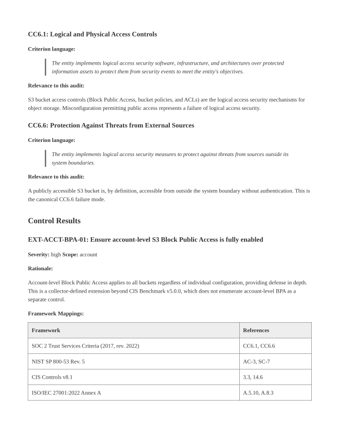

# S3 Public Access Auditor


An automated GRC collection tool that evaluates AWS S3 public access controls and generates auditor-ready, cryptographically verifiable evidence packs.



## Overview

This tool automates the collection and packaging of AWS S3 compliance evidence. It executes read-only API calls against a target AWS account and compiles the results into a cryptographically verifiable `.zip` evidence pack. The final deliverable includes a formally styled PDF audit report, structured JSON findings, raw API response data, and a SHA-256 integrity manifest.

The collector evaluates both account-level and bucket-level S3 Block Public Access configurations, alongside deep inspection of individual bucket policies and ACLs. Findings are evaluated against the CIS AWS Foundations Benchmark v5.0.0 (Controls 2.1.4 and 2.1.5) and mapped directly to SOC 2 Trust Services Criteria, NIST SP 800-53 Rev. 5, CIS Controls v8.1, and ISO/IEC 27001:2022.

## How it Compares

Similar automated checks exist in AWS Config Rules and open-source scanners like Prowler. This tool's differentiator is its focus on GRC engineering: rather than producing a monitoring dashboard or a massive list of alerts, it produces a narrowly scoped, auditor-deliverable evidence pack with formal framework mappings and cryptographic integrity.

## Quick Start

```bash
# Install dependencies
pip install -r requirements.txt

# Run the collector against your AWS account
python collector.py --output-dir /tmp/evidence

# Assemble the verifiable evidence pack
python pack.py --input-dir /tmp/evidence --output-dir /tmp/packs

# Verify pack integrity
cd /tmp/packs && sha256sum -c *.sha256
```

## Example Output

A fully sanitized example of the output this tool produces is available in the repository:
* [View the generated PDF Report](sample_evidence_pack/report.pdf)
* [View the full Evidence Pack](sample_evidence_pack/)

## Evidence Pack Contents

The generated `.zip` deliverable contains:

| File | Description |
|------|-------------|
| `report.pdf` / `report.md` | Formal audit report with executive summary and framework mappings. |
| `findings.json` | SOC 2-organized structured findings data. |
| `manifest.json` | SHA-256 hashes of all files in the pack for integrity verification. |
| `collector_iam_policy.json` | The exact read-only IAM policy required by the collector. |
| `collection_metadata.json` | Identity and timestamp context for the execution. |
| `raw/` | The raw, unmodified AWS API JSON responses used as underlying evidence. |

*(A `.sha256` sidecar file is generated alongside the zip for external verification).*

## Framework Mappings

| Control Scope | Description | SOC 2 | NIST 800-53 R5 | CIS v8 | ISO 27001 |
|---------------|-------------|-------|----------------|--------|-----------|
| **Account** | Block Public Access | CC6.1, CC6.6 | AC-3, SC-7 | 3.3, 14.6 | A.5.10, A.8.3 |
| **Bucket** | Block Public Access | CC6.1, CC6.6 | AC-3, AC-4, SC-7 | 3.3, 14.6 | A.5.10, A.8.3 |
| **Bucket** | Policy & ACL Evaluation | CC6.1, CC6.6 | AC-3, AC-4, SC-7 | 3.3, 14.6 | A.5.10, A.8.3 |

## Design Decisions

* **Scope Ordering:** Account-scoped controls are evaluated and reported before bucket-scoped controls, providing a logical top-down narrative for auditors.
* **Service Principal Handling:** Bucket policy evaluation specifically distinguishes between public wildcards (`*`) and expected AWS service principals (e.g., `cloudtrail.amazonaws.com`), eliminating common false positives.
* **Dual Policy Evaluation:** The tool relies on AWS's authoritative `GetBucketPolicyStatus` while simultaneously parsing the raw policy statements to provide the exact "why" in the finding details.
* **Graceful Degradation:** Enumeration errors or inaccessible buckets are captured as `ERROR` findings and do not halt the collection pipeline.

## Scope and Limitations

The following items are explicitly out of scope for v0.1.0:
* Object-level ACLs (per-object public access)
* S3 Access Points and their public access settings
* Cross-account policies with specific external grants
* Graceful parsing of `AccessDenied` responses
* VPC endpoint policies

## Required IAM Permissions

This collector operates with strict read-only permissions and cannot modify state. 

```json
{
  "Version": "2012-10-17",
  "Statement": [
    {
      "Sid": "S3PublicAccessAuditorReadOnly",
      "Effect": "Allow",
      "Action": [
        "s3:GetAccountPublicAccessBlock",
        "s3:GetBucketAcl",
        "s3:GetBucketLocation",
        "s3:GetBucketPolicy",
        "s3:GetBucketPolicyStatus",
        "s3:GetBucketPublicAccessBlock",
        "s3:ListAllMyBuckets"
      ],
      "Resource": "*"
    }
  ]
}
```

## Architecture

The architecture separates collection from packaging. `collector.py` makes read-only AWS API calls and writes flat JSON files to a staging directory. `pack.py` processes this raw data, groups findings, injects framework metadata from `mappings.yaml`, renders the Jinja2/WeasyPrint templates, and zips the final artifact with cryptographic hashes.

---
**Author:** [Jacob Ferguson](https://www.linkedin.com/in/itlife/)  
**License:** MIT